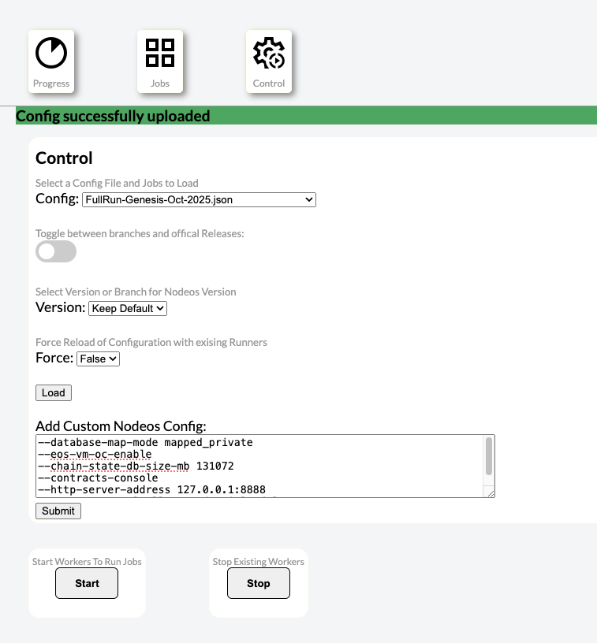

### User Command Options 
Found on the control pane. See below. Once you create a configuration it stays in place until the "stop" button is presses which cleans up and terminates the replay hosts. After creating the user configuration you can view the output by doing the following 
```
curl -L -f --output /tmp/uc.conf https://replay.enf.land/usernodeosconfig/user_provided_cmd_line.conf
```
### `NOTE` All end of lines are removed from the submitted config. Please add spaces at the end of configuration lines otherwise the options will run together. 

The arguments are proved as command line options 
https://github.com/eosnetworkfoundation/chicken-dance/blob/c4e861794aa2f972ccfe161def16b459c8b2182c/replay-client/start-nodeos-run-replay.sh#L202-L220


